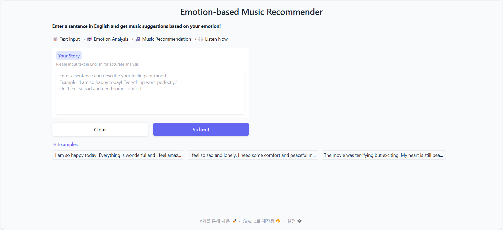
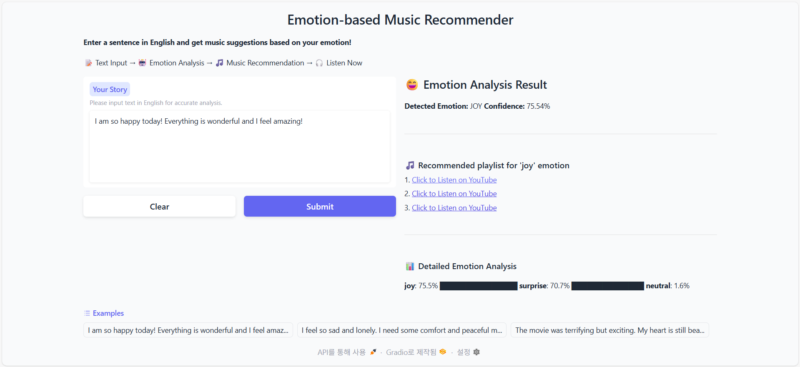

# Emotion-based Music Recommender
## 1. 프로그램 개요

사용자가 입력한 영어 텍스트의 감정을 분석하여 현재 기분에 맞는 유튜브 음악 플레이리스트를 추천하는 웹 애플리케이션입니다.
Hugging Face의 사전 훈련된 감정 분석 모델을 사용하여 텍스트의 핵심 감정을 파악하고, 결과를 확인할 수 있습니다.

## 2. 사용 패키지

프로젝트 실행을 위해 아래 패키지들의 설치가 필요합니다. 

* gradio
* transformers
* torch
* numpy

## 3. 실행 방법

#### 1) 프로그램 실행
app.py 코드를 실행시킵니다.

#### 2) 웹 브라우저에서 접속
서버가 시작되면 터미널에 표시되는 URL(http://127.0.0.1:7860`)을 웹 브라우저 주소창에 입력하여 접속합니다.

## 4. 예시

## 5. 참고 자료

*   **Hugging Face Model**: [j-hartmann/emotion-english-distilroberta-base](https://huggingface.co/j-hartmann/emotion-english-distilroberta-base)
*   **Gradio 공식 문서**: [Gradio Documentation](https://www.gradio.app/docs/interface)
*   **Hugging Face Transformers 라이브러리**: [Transformers Documentation](https://huggingface.co/docs/transformers/index)